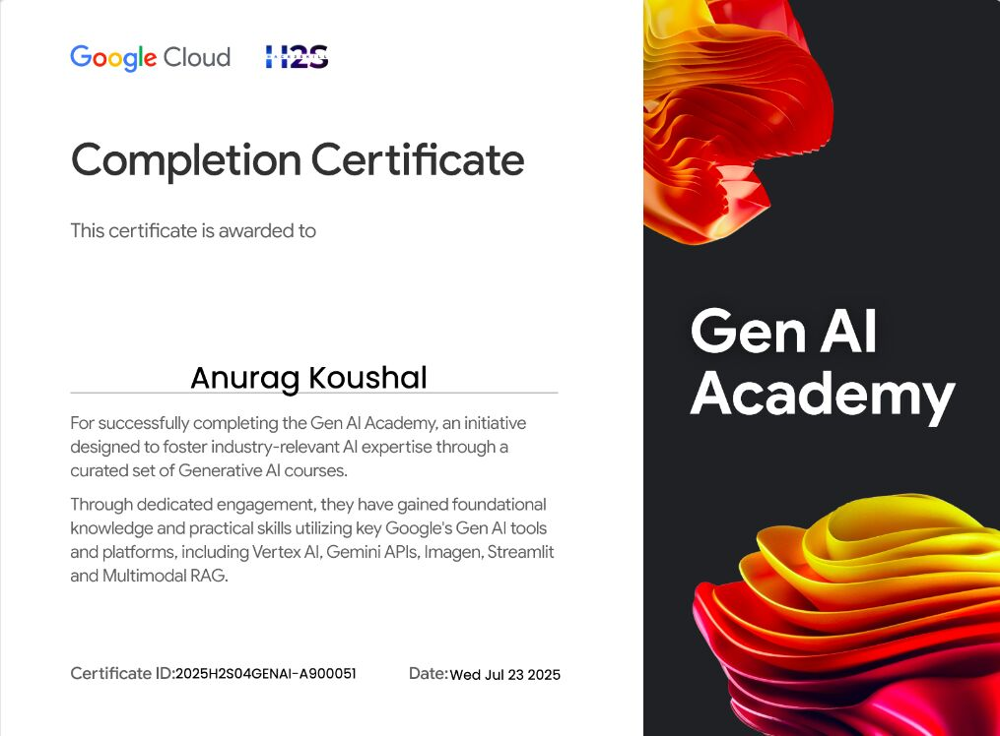

# 📜 Professional Certifications

This repository serves as a **central hub** for all my professional certifications across **Cloud, Gen AI, Data, and Technology domains**.  

## 🎓 Certifications

| Issuer | Certification Name | Description | Certificate |
|--------|--------------------|-------------|-------------|
| Oracle | Oracle Cloud Infrastructure (OCI) AI Foundations | Validates knowledge of **core AI/ML concepts** and their application within Oracle Cloud Infrastructure. | [📂 View Certificate](./Oracle_AI_Foundations_Certification.pdf) |
| Oracle | Oracle Cloud Infrastructure 2025 Certified Generative AI Professional | Demonstrates expertise in designing, deploying, and managing **Generative AI** solutions on OCI. | [📂 View Certificate](./Oracle_2025_Certified_Generative_AI_Professional.pdf) |
| Oracle | Oracle AI Vector Search Certified Professional | Showcases skills in implementing **semantic & similarity search** using vector databases in Oracle 23ai. | [📂 View Certificate](./Oracle_AI_Vector_Search_Certified_Professional.pdf) |
| Oracle | Oracle Cloud Certified Foundation Associate | Validates fundamental knowledge of public cloud services provided by Oracle Cloud Infrastructure (OCI). | [📂 View Certificate](./Oracle_Cloud_Certified_Foundation_Associate.pdf) |
| Google | Google Prompting Essentials | Hands-on certification focused on building practical AI prompting skills. Covers designing effective prompts and applying advanced prompting techniques to solve complex tasks, perform data analysis, and summarize information with precision. | [📂 View Certificate](./Google_Prompting_Essentials.pdf) |
| AWS | AWS Cloud Quest: Generative AI Practitioner | Demonstrates proficiency in building **generative AI solutions** utilizing AWS AI services. Includes hands-on experience with **prompt engineering, code generation, chatbot development, implementing content moderation systems, and fine-tuning models** for enhanced performance. | [📂 View Certificate](https://www.credly.com/badges/4203fde5-aa1a-4a14-9da1-2184a0921384/linked_in?t=t11vp6) |
| Google Cloud | Google Gen AI Academy | Successfully completed the **Gen AI Academy** program, gaining foundational and practical skills in **Vertex AI, Gemini APIs, Imagen, Streamlit, and Multimodal RAG**.  🏆 **Special Recognition** 🌟 *Top Learner Award* — Awarded by **Google Cloud** as one of the Top Learners in the Gen AI Academy program. 📄 [View Appreciation Letter](./Google_Cloud_Appreciation_letter.jpeg) |  |
